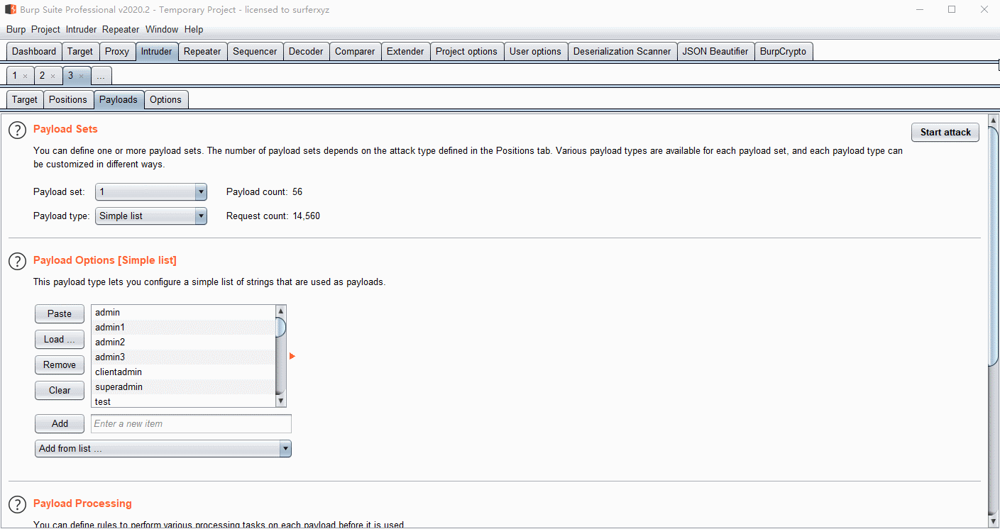
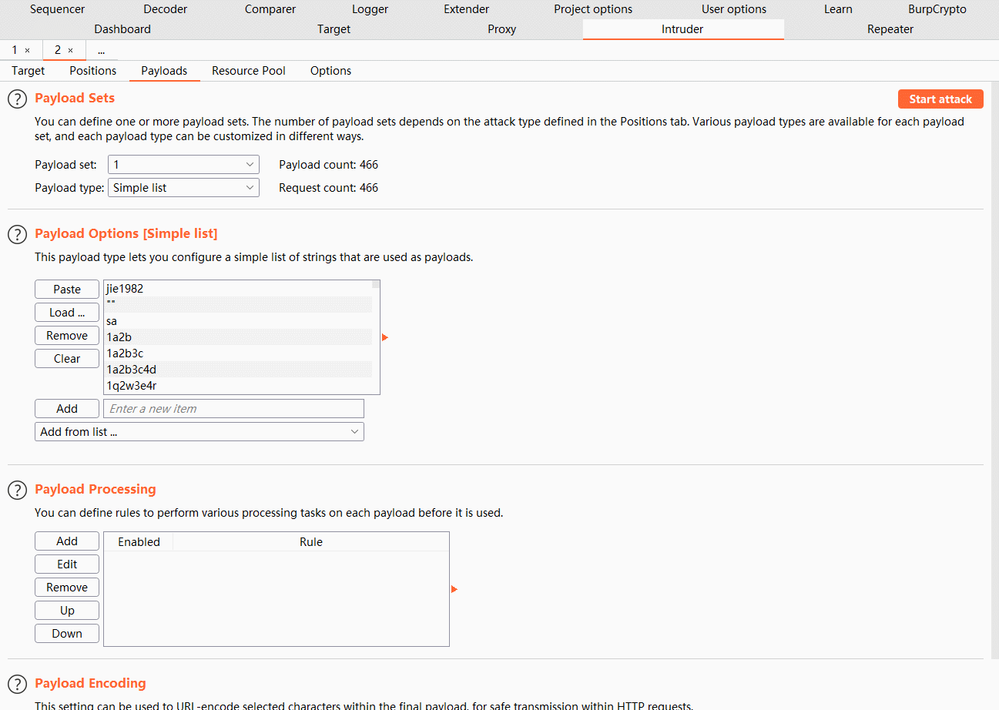

# BurpCrypto

Burpcrypto is a collection of burpsuite encryption plug-ins, supporting AES/RSA/DES(todo)/ExecJs(execute JS encryption code in burpsuite).

## Screenshots

AES Example:

ExecJs Example (Here is the modified MD5 algorithm):

